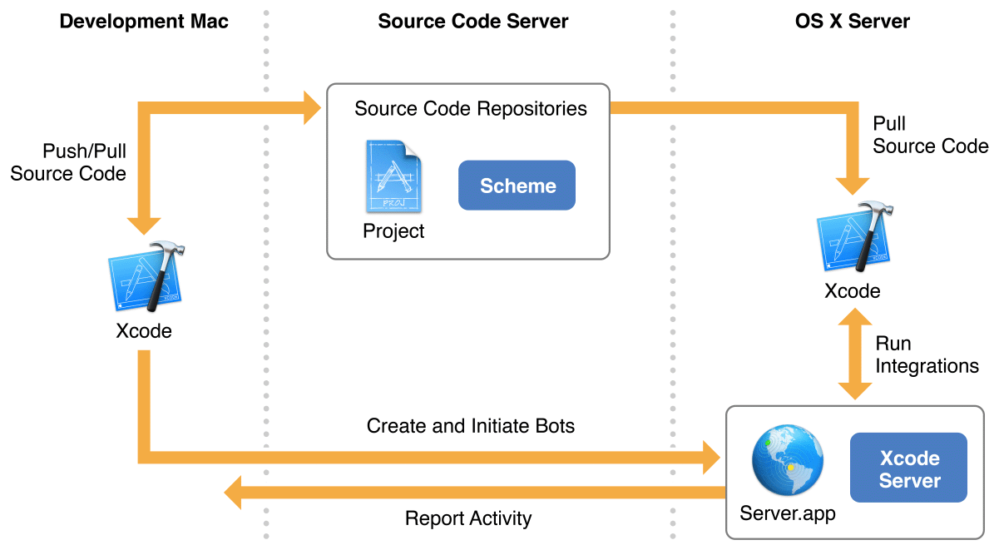
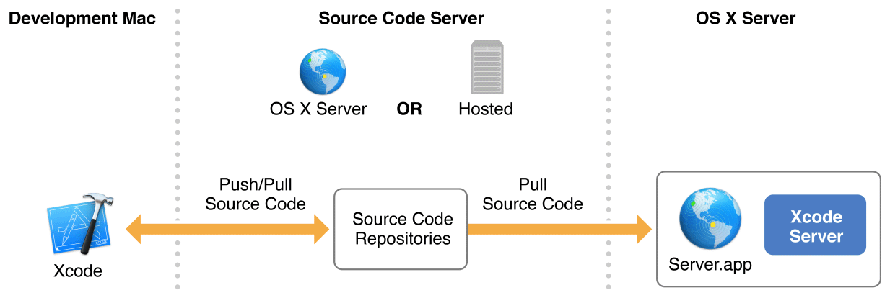
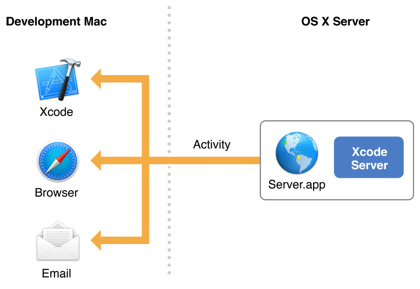

# 关于Xcode中的持续集成
在Xcode中，持续集成是自动的并且简化Mac和iOS应用程序的构建、分析、测试和打包的过程，确保应用程序永远保持可发布状态。在持续集成工作流中，使用Mac上的Xcode本地编写应用并将代码迁入一个代码仓库中。然后将代码发送到Xcode Server进行处理，Xcode Server是由OS X Server提供的一个服务。在开发Mac的Xcode中，将运行在server上的bot程序设置好。这些bot程序会使用仓库中的源代码来处理你的APP，并且报告结果。每一次运行bot程序都称为一次集成，这些行为在应用程序的整个开发生命周期中定期进行。参见图1-1：

持续集成的目标是提高软件质量，以下是一些实现方式：

* **快速、便捷并且及早的捕获问题**。bot集成程序可以设置为当您每次向代码仓库提交代码时、特定计划、或者手动启动时执行。这允许您在整个开发过程中识别代码问题，发生问题时解决问题，防止小问题导致大的问题。
* **加强协作**。在整个持续集成工作流中，您的整个团队（或者选定的个人）可以创建bot,触发集成，查看动态和下载构建文件。如果出现问题，可以自动通知编写出错代码的成员。
* **扩大测试覆盖面**。在本地工作时，在具有多个配置的多个设备上测试APP是一个手动的并且时间密集的过程。在持续集成工作流中，这却是自动和简单的。只需要将多个设备绑定到服务器上，或者配置您的工作流使用不同的模拟器，相应地配置bot，让系统为您完成测试工作。
* **随着时间推移生成构建版本和测试的统计信息**。在持续集成工作流中，所有的进程和错误都会生成日志。在任何给定时间内，您都可以看到您的app进行到开发过程的哪一步以及她的成长过程。

## 初见
按照本文档中概述的步骤，使用Xcode Server搭建一个持续集成工作流。

### 安装并设置Xcode Server
实现持续集成工作流的第一步是安装和配置Xcode Server以执行您的集成。即使您从未设置过服务器，您也会发现设置OS X Server并且开启Xcode Server是快速和简单的。

> **相关章节**

> 安装OS X Server并配置Xcode Server：[官方文档](https://developer.apple.com/library/content/documentation/IDEs/Conceptual/xcode_guide-continuous_integration/adopt_continuous_integration.html#//apple_ref/doc/uid/TP40013292-CH3-SW1)，[中文文档](2.md)

### 连接Xcode Server到源代码仓库
为了让bot能够在Xcode Server进行项目的集成，bot必须能够访问项目的源代码。Xcode Server支持两种流行的源代码控制系统：Git和SVN。在您开发的Mac上，您编写源代码并且推送到源代码仓库。这个仓库可以放置在远程服务器（Git或SVN）或者OS X Server（仅Git）。每当执行集成操作，bot都会拉取您最近的源代码。参见图1-2：

> **相关章节**

> 启用对源代码仓库的访问：[官方文档](https://developer.apple.com/library/content/documentation/IDEs/Conceptual/xcode_guide-continuous_integration/PublishYourCodetoaSourceRepository.html#//apple_ref/doc/uid/TP40013292-CH8-SW1)，[中文文档](3.md)

### 创建并执行bot
bot处于Xcode Server自动化工作流的中心。bot通过您设置的Scheme来构建和测试您的项目。由于Xcode Server能够访问项目的源代码仓库，因此您可以创建bot，并设置为定期、每次提交代码时或者手动执行。您也可以配置bot在集成成功或失败时发送Email通知。Xcode Server同时允许bot执行性能测试和启动集成前后触发器。

> **相关章节**

> 配置bot以执行持续集成：[官方文档](https://developer.apple.com/library/content/documentation/IDEs/Conceptual/xcode_guide-continuous_integration/ConfigureBots.html#//apple_ref/doc/uid/TP40013292-CH9-SW1)，[中文文档](4.md)

### 监控并管理Bot
Xcode Server通过开发Mac上的Xcode,浏览器和Email通知向您提供集成状态的详细信息。在您开发Mac上的Xcode报告导航栏中，您可以管理bot，查看测试结果，读取集成日志，执行或取消集成，下载产品归档文件。Xcode Server还托管了一个网站，在这个网站您和您的团队成员可以通过浏览器查看bot程序状态，下载文件和产品。bot还可被设置在集成成功、失败或者发生警告时发送Email通知。参见图1-3

> **相关章节**

> 从报告导航器管理和监测Bot：[官方文档](https://developer.apple.com/library/content/documentation/IDEs/Conceptual/xcode_guide-continuous_integration/view_integration_results.html#//apple_ref/doc/uid/TP40013292-CH4-SW1)，[中文文档](6.md)

## 先决条件
在设置一个持续集成工作流时，最好了解如何测试和调试 Xcode应用。测试和调试相关信息，参见[使用Xcode进行测试](https://developer.apple.com/library/content/documentation/DeveloperTools/Conceptual/testing_with_xcode/chapters/01-introduction.html#//apple_ref/doc/uid/TP40014132)，[使用Xcode进行调试](https://developer.apple.com/library/content/documentation/DeveloperTools/Conceptual/debugging_with_xcode/chapters/about_debugging_w_xcode.html#//apple_ref/doc/uid/TP40015022)和[Instruments用户指南](https://developer.apple.com/library/content/documentation/DeveloperTools/Conceptual/InstrumentsUserGuide/index.html#//apple_ref/doc/uid/TP40004652)

## 其余参考
Xcode Server web API允许集成您自己的工具和进程来扩展Xcode Server的能力。参考文档参见[Xcode Server API Reference](https://developer.apple.com/library/content/documentation/Xcode/Conceptual/XcodeServerAPIReference/index.html#//apple_ref/doc/uid/TP40016472-CH1-SW1)。

OS X Server其余功能参考[OS X Server: Advanced Administration](http://help.apple.com/advancedserveradmin/mac/3.0/)

