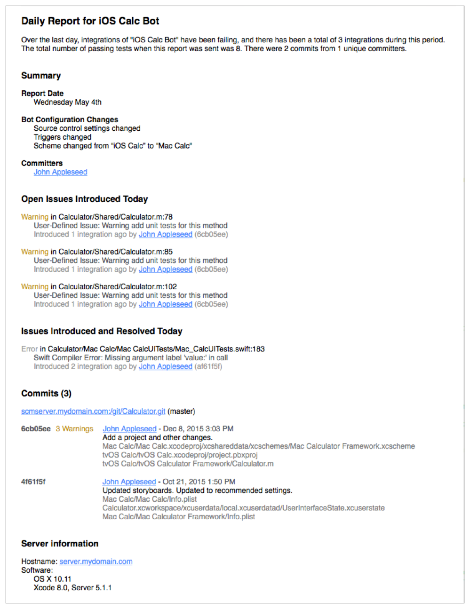

# 配置bot以执行持续集成
bot是Xcode Server在源代码仓库中对当前版本的项目执行持续集成的进程。bot运行一次就是一次集成。集成包括对定义在Xcode项目中的应用（或其他软件产品）进行构建、分析、测试和归档。当Xcode Server能够访问项目的源代码仓库，你可以配置bot来执行应用的持续集成。
在开发Mac上，_scheme_是构建您产品的方案。一个scheme包含target、源文件和构成产品的所有其他内容。它同时也定义了在集成期间bot执行的操作。要自动化集成，您需要共享scheme并创建一个bot在需要的时候使用scheme执行集成。bot可被配置运行在：

  - 当有更改提交到仓库时。
  - 固定时间表，例如每小时、每天或每周。
  - 手动启动时。
  
bot也会在您安装或更新新版本Xcode时自动运行集成。这些集成在运行任何正常计划的集成之前立即运行。将这些集成与以前的集成进行比较，以确定升级后可能遇到的问题。

## 共享构建schemes
一个scheme指定使用哪个target来构建项目、使用哪种构建配置和在产品启动时使用哪种可执行环境。当您创建了一个新的iOS或OS X项目，Xcode创建一个包含执行以下操作的默认的scheme：

  - 分析，执行静态代码分析。
  - 测试，执行您实现的测试用例。
  - 归档，构建scheme构建的产品的存档。
  - 
对于Xcode Server对项目上执行这些操作，您必须共享项目的scheme。共享的scheme是您在存储库中发布的方案，以及其他共享的项目文件。

**共享一个Xcode项目的scheme**

  1. 在您的开发Mac上，check out并打开您想共享scheme的项目。
  2. 选择`Product > Scheme > Manage Schemes`。
  3. 勾选要进行共享的scheme的`Shared`勾选框。
  
    
    
  4. 选择`Source Control > Commit`。
  5. 勾选`Shared Data`文件夹。
  6. 在输入栏中输入提交信息。
  7. 勾选`Push to remote`选项（如果您的项目由Git管理）。
  8. 单击"Commit Files and Push"按钮。
  
scheme是Xcode构建系统中重要的一部分。然而，对于使用持续继承的目的，重要任务是将所选择的scheme设置为共享的并签入仓库中以供bot使用。有关管理scheme的更多信息，参见[Xcode Help](https://help.apple.com/xcode)。

## 创建bot以执行集成
共享scheme后，创建一个bot来使用这个scheme执行集成。

**创建bot**

  1. 在你的开发Mac上，打开包含定义自动化操作的scheme的Xcode项目。
  2. 选择`Product > Create Bot`，为bot指定一个名称，选择一个服务器，单击`Next`。
  
    
    
  3. 选择一个仓库并点击`Sign In`来提供仓库的凭据，即使您已经在Xcode首选项中添加过，因为每个bot会在服务器上的钥匙串中保存一份自己的凭据。
  
    
    
    当提示框弹出时输入您的身份验证凭据，然后点击`OK`。
    
    
    
  4. 配置bot需要的属性，单击`Next`。
  
    
    
    - 选择一个scheme并表明是否通过项目的源代码仓库共享scheme。
    - 通过勾选合适的复选框来指名bot的操作。您可以开启静态分析、测试和产品归档。
    - 选择是否在构建之前清理项目。当执行一个干净的集成时，bot不会重复使用原先的构建文件。通过弹出的清理菜单指明清理的频率：在每次集成之前、一天一次、一周一次或从不。
    - 如果您有其他的工具链安装在` /Library/Developer/Toolchains/`中，例如从[Swift.org](http://swift.org/)下载的工具链，选择一个工具链在运行集成时使用。要使用默认工具，请设置工具链弹出框菜单为`Do Not Override`。
    
    > **重要**

    > 如果您使用其他的工具链，您可能会遇到复原状况，因为其他的工具不会完全由苹果官方发布。

  5. 指定集成计划，单击`Next`。
  
    您可以安排bot定期（每小时、每天或每周）、每次提交或手动集成。
    
    
    
  6. 对于iOS应用，选择bot使用哪种设备或模拟器执行测试，单击`Next`。
  
    您指定的所有设备必须连接到服务器上才能完成测试操作。
    
    
    
  7. 定义`Run Script`构建阶段所需的任何环境变量，它们作为集成的一部分执行，或用于预集成和后集成触发器，然后单击“Next”。
  
    

    > **备注**
  
    > 除了在此定义的自定义环境变量之外，您还可以在作为集成，预集成触发器和后集成触发器一部分执行的Run Script构建阶段使用Xcode Server的内置环境变量。有关这些变量列表，参见_Xcode Server环境变量参考_：[官方文档](https://developer.apple.com/library/content/documentation/IDEs/Conceptual/xcode_guide-continuous_integration/EnvironmentVariableReference.html#//apple_ref/doc/uid/TP40013292-CH14-SW1)，[中文文档](5.md)。

  8. bot可以配置为在集成前或集成后执行称为触发器的操作。一个触发器可以运行自定义shell脚本并发送邮件报告。
  
    - 预集成触发器在集成前执行。要创建预集成脚本，在脚本面板底部单击添加按钮（+）并从弹出菜单中选择`Pre-Integration Script`。输入想要的脚本到脚本面板。此脚本可以引用您在先前配置步骤中定义的任何环境变量。它还可以引用Xcode内置的环境变量。
    
      
      
    - 后集成触发器在集成完成后运行。要创建后集成脚本，在脚本面板底部单击添加按钮（+）并从弹出菜单中选择`Post-Integration Script`。输入想要的脚本到脚本面板。此脚本可以引用您在先前配置步骤中定义的任何环境变量。它还可以引用Xcode内置的环境变量。后集成触发器可以配置为有条件地运行，例如成功、测试失败、构建错误、构建警告或静态分析警告时。为您的集成勾选合适条件的复选框。
    
      
      
    - 邮件通知触发器在有新问题出现时、执行集成后、每天或每周执行。要创建邮件通知触发器，在脚本面板底部单击添加按钮（+）并从弹出菜单中选择`Email Notification`。指定仅有新问题出现时通知还是定期汇总报告。新问题报告会提交给提交者。对于摘要报告，您必须指定收件人。选择要包括的信息以及发送报告的条件，例如成功，测试失败，构建错误，构建警告或静态分析警告时。
    
      
      
    以下屏幕截图显示了每日摘要报告的电子邮件通知的示例。
    
    

  9. 单击`Create`来建立bot。

正如在[Manage and Monitor Bots from the Report Navigator](https://developer.apple.com/library/content/documentation/IDEs/Conceptual/xcode_guide-continuous_integration/view_integration_results.html#//apple_ref/doc/uid/TP40013292-CH4-SW1)（[中文文档](6.md)）所阐述的，使用报告导航器来手动开启、编辑和删除bot。使用Web浏览器来监测bot状态，下载集成文件并安装iOS产品，参见[Monitor Bots from a Web Browser](https://developer.apple.com/library/content/documentation/IDEs/Conceptual/xcode_guide-continuous_integration/MonitorBotsandDownloadProductsfromaWebBrowser.html#//apple_ref/doc/uid/TP40013292-CH10-SW1)（[中文文档](7.md)））。

## 遵循最佳实践
要利用好产品开发流程中的持续集成，请遵循以下准则：

- **开发测试套件和测试用例**。开发测试后，将它们包括在bot运行的scheme中。为了帮助确保您所做的更改不会被您或其他人所破坏，请用测试来确定这些更改是否与预期的顺序中所使用的方法或一组方法相匹配。
- **执行静态分析**。在您的集成中加入静态分析。静态分析是对代码的深入检查，遵循您的程序在正常开发中可能没有遵循的代码路径。此过程揭示了难以找到的编码错误，并且还标识代码中不遵循建议的API使用情况的区域，例如Foundation和AppKit习语。
- **进行性能测试**。为您的程序在不同设备上执行性能测试。这将允许您在向用户分发产品之前跟踪您的产品性能并识别潜在的问题。
- **确保您的产品正确构建和打包**。在重大更改后归档您的产品，特别是结构改变，比如添加或删除文件时。让bot自动为您进行归档。构建和存档产品的能力是代码更改正确性的主要指标。

有关Xcode中广泛测试功能的详细信息，请参阅[Testing with Xcode](https://developer.apple.com/library/content/documentation/DeveloperTools/Conceptual/testing_with_xcode/chapters/01-introduction.html#//apple_ref/doc/uid/TP40014132)。