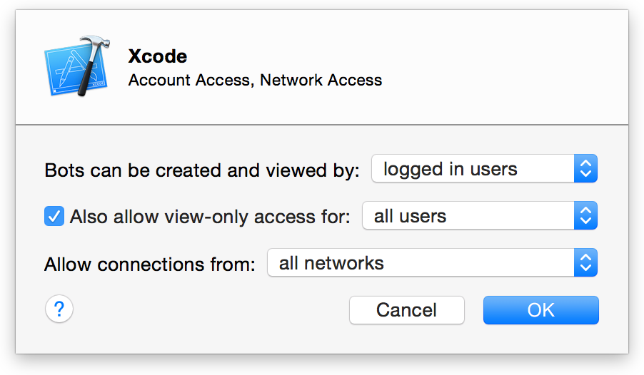
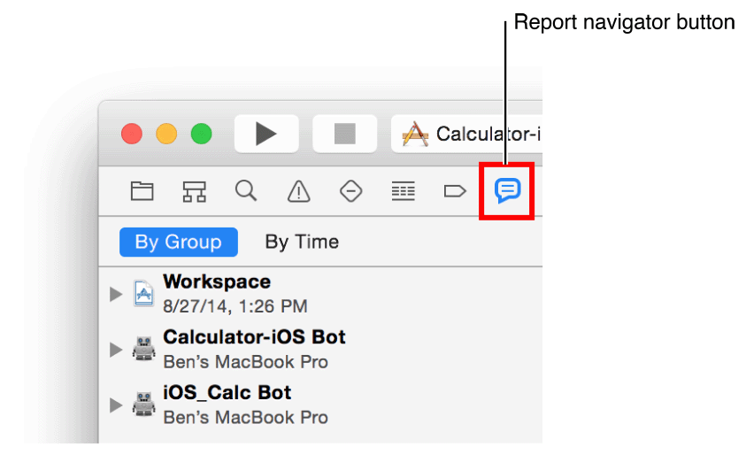
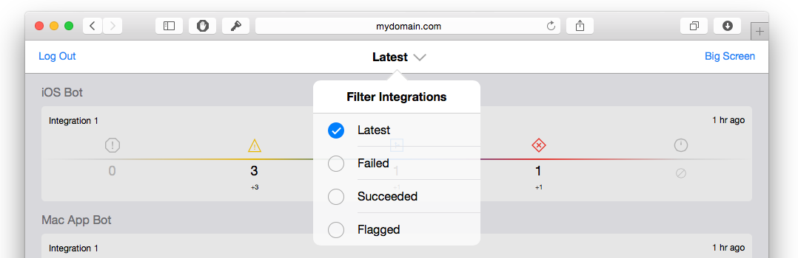

# 从Web浏览器监控Bot
托管在您服务器上的网站提供bot的活动摘要，以及集成的详细信息。从bot的网站上，您和您的团队可以查看bot的活动并下载产品的构建和归档文件。（产品只包括app，归档包含Xcode项目）。

**指定谁可以查看和使用bot网站**

  1. 在Server的侧边栏服务列表上，选择Xcode。
  
    
    
  2. 在Xcode面板上，单击`Settings`标签。
  
    
    
  3. 单击`Edit Permissions`。
  
    
    
  4. 当对话框出现时，指定谁可以创建和查看bot，还有下载归档和产品。
  
    
    
    - 如果您从弹出菜单中选择"all users"，所有访问网站的访问者都可以查看bot并下载项目。
    - 如果您选择"logged in users"或者"only some users",未经验证的用户查看bot主页将不显示数据。网页左上角有一个登录按钮允许用户通过可用的用户名和密码登录。（关于在server上创建账户，请参阅[Set Up Xcode Server for Team Members](https://developer.apple.com/library/content/documentation/IDEs/Conceptual/xcode_guide-continuous_integration/adopt_continuous_integration.html#//apple_ref/doc/uid/TP40013292-CH3-SW5)（[中文文档](2.md)））。
    - 如果您选择"only some users"，则会看到一个用户和组表。添加和删除用户和组来满足您的需要。
    
  5. 要允许或限制只能查看网站的访问权限，在弹出菜单中使用"Also allow view-only access for"和"Allow connections from"。
  
    用户只可查看权限的用户可以访问网站并开启集成，但是他们不能创建和管理bot。特别受益于具有只访问bot活动的权限的人员是软件测试人员，项目经理和项目协调员。

## 查看bot网站
要查看bot网站，在web浏览器中导航至地址_hostname/xcode/_,_hostname_是服务器的网络域名（比如`server.mycompany.com`）或者其本地主机名（比如`server.local`）。根据在Xcode Server中配置的查看权限，可能会提示您使用本地或Open Directory账户凭据登录。

bot主页（图7-1）显示了在服务器上运行的bot的最近的集成摘要列表。

bot网站也可以从Server应用中访问。

**从OS X Server应用中访问bot网站**

  1. 在Server的侧边栏服务列表上，选择Xcode。
  
    
    
  2. 在Xcode面板上，单击`Settings`标签。
  
    
    
  3. 在设备列表下方，点击"View bots"按钮。
  
    
    
    web浏览器将会打开并跳转到bot网站。

您也可以从您的开发Mac上的报告导航器中访问bot网站。

**从报告导航器中访问bot网站**
  
  1. 在您开发Mac的Xcode中，选择`View > Navigators > Show Report Navigator`。
  
    
    
  2. 在报告导航器顶部点击`By Group`。
  
    
    
    所有的集成都通过bot名称进行分组。
  3. 在报告导航器中按住`Control`点击bot，从快捷菜单中选择`View Bot in Browser`。
  
    
    
    web浏览器将会打开并跳转到bot网站。

**从bot网站上登出**

  - 在bot主页左上角点击`Log Out`按钮。
  
    

## 从bot网站上监测Bot
您可以在bot主页上通过轻触或点击一个bot或集成来查看最近bot的集成摘要。

**过滤bot集成**
  
  1. 在bot主页的标题中心单击过滤按钮。
  2. 从弹出菜单中选择需要的条件来过滤集成列表。
  
    
    
    - _Latest_显示每个bot最近完成的集成。
    - _Failed_显示每个bot最近失败的集成。
    - _succeeded_显示每个bot最近成功的集成。
    - _Flagged_显示每个bot最近被标记的集成。
    
  当您进行选择后，主页的标题将显示活跃的过滤调节。

**查看bot的集成结果**

  - 在bot主页的列表上点击bot或集成的名称。
  
    
    
    将会显示由bot执行的最近集成的摘以及提交。
    
    您可以点击标记按钮来标记一个特定的集成以作区分，例如，作为发布候选版本。标记的意义取决于您和您的组织。
    
    

## 从Bot网站打开Xcode中的bot
bot网站提供了一个途径来快速打开您开发Mac上Xcode中的bot。

**打开一个Xcode中的bot**

  1. 当在您的开发Mac中查看bot网站时，单击bot主页列表上任意的bot或集成。您的浏览器窗口将会显示bot最近执行的集成的摘要。
  2. 点击"Open in Xcode"链接。
  
    
    
    Xcode将会打开这个bot。

## 从bot网站上下载集成文件
bot网站有助于向测试人员和其他团队成员分发产品文件，构建和归档（如果适用）。产品只包含应用程序，而归档包含Xcode项目。

**在OS X中下载集成日志和文件**

  1. 点击bot主页列表上任意的bot或集成名称。您的浏览器窗口将会显示bot最近执行的集成的摘要。
  2. 点击`Download`链接来下载集成的日志和文件。
  
    

**在OS X中下载集成的归档**

  1. 点击bot主页列表上任意的bot或集成名称。您的浏览器窗口将会显示bot最近执行的集成的摘要。
  2. 如果可用，点击`Archive`链接，下载产品的归档文件（Xcode项目）。
  
    
    
  如果集成没有包含`Archive`链接，集成则未带有归档文件。

**在OSX中下载集成产品**

  1. 点击bot主页列表上任意的bot或集成名称。您的浏览器窗口将会显示bot最近执行的集成的摘要。
  2. 如果可用，点击`Product`链接，下载产品的产品（应用程序）。
  
    
    
  如果集成没有包含`Production`链接，集成则未带有产品文件。

## 从Bot网站安装iOS产品
对于iOS产品，bot网站允许为集成以及产品（应用程序）本身安装Over-the-Air产品安装所需的配置文件。如果bot是一个iOS项目并且集成包含产品，蓝色或绿色的安装按钮将会出现在集成摘要界面。蓝色安装按钮表明需要安装Xcode Server Over-the-Air安装配置文件，绿色安装按钮表明产品可以直接安装。

**在iOS设备上安装集成的Over-the-Air安装配置文件**

  1. 点击bot主页列表上任意的bot或集成名称。您的浏览器窗口将会显示bot最近执行的集成的摘要。
  2. 点击蓝色安装按钮来安装集成的应用。
  
    
    
  当您安装好配置文件后，安装按钮的颜色会从蓝色变为绿色，表明现在可以安装产品。

**在iOS设备上安装集成的产品（应用程序）**

  - 当安装好集成的配置文件后（参考以上说明），单击绿色安装按钮来安装产品。
  
    

## 在Big Screen上查看您的bot
要在大型或专用显示器上显示bot的状态，请使用`Big Screen`查看。

**在Big Screen上查看bot**

执行以下操作之一：

  - 显示`Big Screen`网站——_hostname/xcode/bigscreen_，_hostname_是服务器的网络域名（比如`server.mycompany.com`）或者其本地主机名（比如`server.local`）。
  - 点击bot主页右上角的`Big Screen`按钮。
  
    

网页可以全屏，也可以通过AirPlay镜像显示。`Big Screen`循环显示所有服务器的bot，每个bot只显示最相关的状态信息。bot列表及其最近完成的结果显示在左侧。对于正在循环的bot将会显示错误、警告、提交和测试数量。通过加号（+）或减号（-）来标识相对于之前集成数量的增加和减少。

对于bot的集成，提交者名字首字母显示并包含在一个白色圆圈内。这个圆圈表明对于当前集成，提交者相对于所有提交贡献的代码量。彩色的圆圈标识提交者贡献的代码导致的问题量（如果有的话）。红色菱形表示错误，黄色三角形表示警告，蓝色方块表示静态分析问题。参考图7-2.

