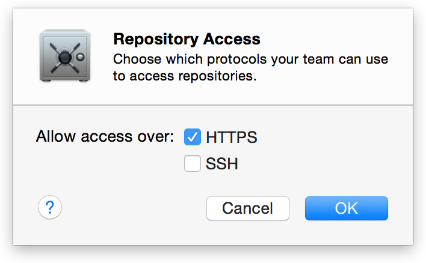
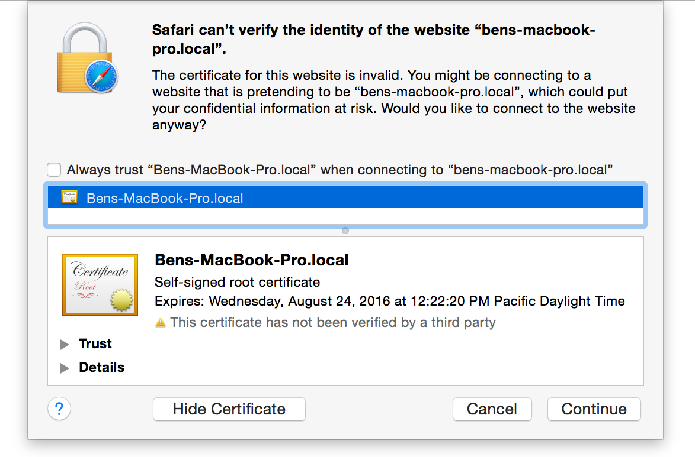
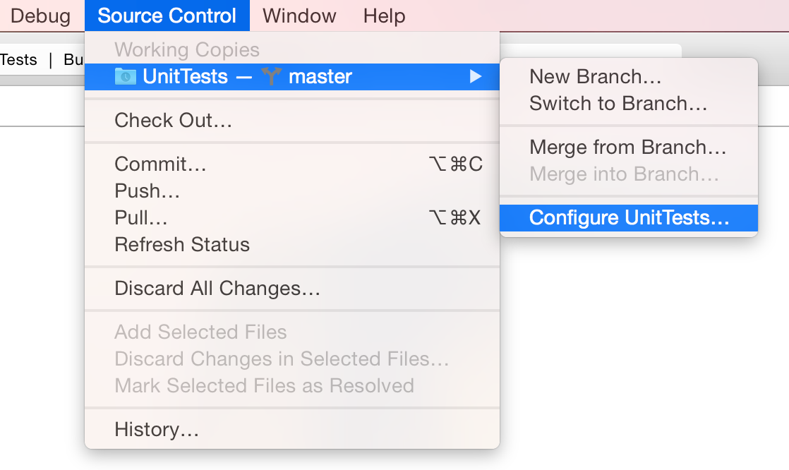
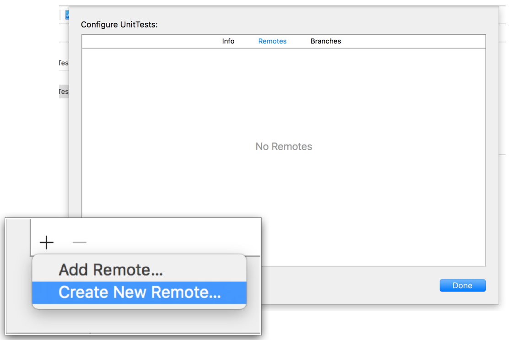
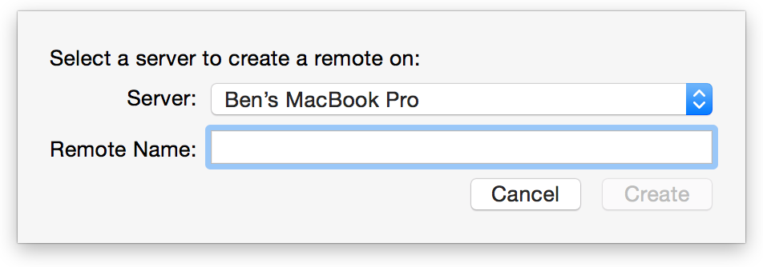
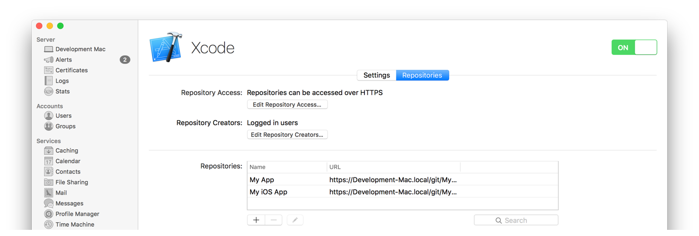
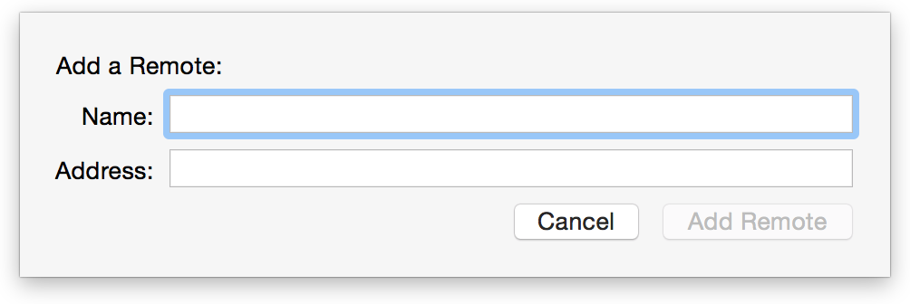
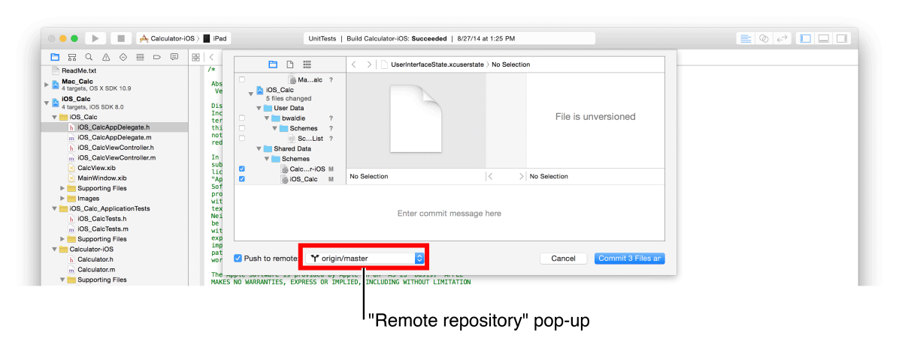

* 开始
  * [使用Xcode进行持续集成](quiver:///notes/B8F910ED-9426-4002-918D-079DEBDADFED)
* 设置Xcode Server
   * [安装OS X Server并配置Xcode Server](quiver:///notes/B155FC18-728C-43C3-8B18-90A5BCC53A3C)
   * [启用对源代码仓库的访问](quiver:///notes/E631BFE3-D44B-415A-AD71-2000EE434F76)
   * [配置bot以执行持续集成](quiver:///notes/65119961-EEA9-48ED-BDC5-6084BABDAF24)
   * [Xcode Server环境变量参考](quiver:///notes/D1A19475-8618-4E27-B801-143C7B0DDB01)
* 管理和监测Bot
   * [从报告导航器管理和监测Bot](quiver:///notes/3BC9417A-D0CC-4BF6-A8C5-DBF427699713)
   * [从Web浏览器监控Bot](quiver:///notes/C97641EE-3B4E-4BE9-A2CF-39B4FB276DA7)

# 启用对源代码仓库的访问
Xcode Server对包含在源代码仓库中的项目进行操作。Xcode Server支持两种主流的源代码控制系统：Git和Subversion。您的bot可以连接到托管在远程服务器上的或者设置并托管在OS X Server上的Git和Subversion。
如果您目前还没有设置Xcode Server ,请参照_安装OS X Server并配置Xcode Server_：[ 官方文档](https://developer.apple.com/library/content/documentation/IDEs/Conceptual/xcode_guide-continuous_integration/adopt_continuous_integration.html#//apple_ref/doc/uid/TP40013292-CH3-SW1)，[中文文档](quiver:///notes/B155FC18-728C-43C3-8B18-90A5BCC53A3C)。

> **备注**

> Git和Subversion是免费并且开源的代码版本管理系统。有关这些系统的信息，请求访问以下网站：

> - [Git project website](https://git-scm.com/)

> - [Apache Subversion (SVN) project website](https://subversion.apache.org/)

## 仓库验证选项
Xcode bot可以通过SSH(Secure Shell)或者HTTPS(Hypertext Transfer Protocol Secure)访问Git和Subversion。通常，SSH是Git项目的首选协议，Subversion项目建议使用HTTPS。

### 关于SSH
SSH加密凭据和事务，通常比HTTPS简单，因为它始终是安全的并且不需要SSL(Secure Sockets Layer)证书。SSH是一个好的并且安全的选择，当你的组织使用SSH密钥来进行身份验证将是非常有用的。然而，在网络环境中，SSH并不总像HTTPS一样容易获得。

通过SSH访问仓库可以通过以下几种方式进行身份验证：

- **SSH用户名和密码**。这对于你的组织所维护的任何托管的仓库都是一个很好的选择，因为不需要在托管机器上进行重大的设置。您只需要开启SSH并确保相应的用户通过验证即可连接。当您配置bot的时候提供凭据，这些用户名和密码将会存储在服务器的加密钥匙串当中。因为凭据不是共享的，所以任何使用同一个仓库的bot都保存其自己的凭据。
  当一个bot clone或check out一个工程时，bot会使用"键盘交互"身份验证方法验证托管仓库并响应来自远端计算机的登录提示。如果一个用户名是被嵌入在仓库的URL中的，那么它将总是被使用的，而不是提示bot。
- **SSH密钥**。RSA(一种流行的加密类型)密钥也可以被用在通过SSH连接托管的远程仓库。对于第三方仓库的托管方案，这通常是最好的也是最安全的连接方案。很多主机解决方案允许公钥复制和粘贴到网站的账户设置栏中，以允许新的密钥连接。

  只要有可能，最好为每一个bot生成唯一的密钥对，并复制公钥到远程仓库。这允许bot凭据被独立的跟踪。为了方便，在设置bot的时候，Xcode可以生成唯一的密钥。在这种情况下，Xcode会生成一个带有密码的2048位RSA密钥对，当bot check out或clone代码时将会使用这个组合。另外，Xcode也可以使用本地机器上已存在的密钥或者手动输入密钥。默认情况下，Xcode建议将现有密钥安装到 ~/.ssh/id_rsa中。可以通过手动将新密钥粘贴到相应字段中并提供您的密码来覆盖此建议。

> **备注**

> 使用Git角色账户配置的第三方托管解决方案和服务器并不总是支持通过用户名和密码认证SSH来clone或check out仓库，即使您具有该服务器的有效用户名和密码。在这种情况下，通常需要HTTPS或带有SSH密钥的SSH。

### 关于HTTPS
由于HTTPS协议容易设置并且能够工作在大多数网络环境中，所以HTTPS提供了一些便捷性。使用HTTPS，您的认证凭据和操作是被加密的，您需要一个由公共证书颁发机构签署的有效证书。如果您有相应服务器的SSL证书，HTTPS是一个好的并且安全的选择。然而，这比SSH需要更多的配置，因为需要运行一个web服务器来使用HTTPS。

通过HTTPS访问仓库可以通过以下几种方式进行验证：

  - **匿名访问**。不像SSH，HTTPS支持未验证时使用加密（当使用SSL时）传输。在创建bot的时候这些仓库不应该添加额外的设置。
  - **用户名和密码**。bot也能够配置通过用户名密码响应基本的HTTP验证请求。当bot从仓库clone或checkout一个项目时，嵌入到仓库URL中的任何用户名和密码都将被验证。
  
> **已知问题**

> 摘要认证（有时用于在不使用SSL时通过HTTP连接提供最小的安全性），目前不支持Git存储库。此外，在本地计算机上受信任的自签名证书可能无法在服务器上进行身份验证。

### 推荐阅读
有关SSH和HTTPS的详细信息，请参阅以下资源：

- [OS X Server: Advanced Administration](https://help.apple.com/advancedserveradmin/mac/3.0/)
- [Git on the Server - The Protocols](https://git-scm.com/book/en/v2/Git-on-the-Server-The-Protocols)

## 从您的开发Mac上连接到远程仓库
如果您的项目在远程服务器上的Git或Subversion仓库中，您可以可以在您的开发Mac中Xcode里的`Account`首选项中保存这些凭据。之后当你需要访问这些仓库时，您不必每次再去输入凭据。当Xcode Server执行项目集成时，它必须能够访问相应项目的源代码仓库。你在设置bot时需要提供这些凭据，正如_配置bot以执行持续集成_：[官方文档](https://developer.apple.com/library/content/documentation/IDEs/Conceptual/xcode_guide-continuous_integration/ConfigureBots.html#//apple_ref/doc/uid/TP40013292-CH9-SW1)，[中文文档](quiver:///notes/65119961-EEA9-48ED-BDC5-6084BABDAF24)所述。

**添加一个远程仓库的验证凭据到开发Mac**

 1. 在您的开发Mac上，选择`Xcode > Preferences`。
 2. 单击工具栏上的`Accounts`选项。
 3. 单击添加按钮（+），选择`Add Repository`。
 4. 在文本框中，输入仓库URL（例如：svn+ssh://svn.example.com/ProjectName or https://example.com/git/repository.git ），单击`Next`按钮。
 5. 在`Accounts`首选项的仓库面板上，输入你的用户名和密码。

## 使用Xcode Server托管Git仓库
如果您的仓库没有托管到远程服务器中，您可以使用OS X Server和Xcode Server来创建并共享Git仓库。如果您在一个开发团队中工作，成员可以共享和管理他们在这些仓库中的代码更改，加强协作。

配置OS X Server和Xcode Server来创建托管的源代码仓库，并允许团队成员访问它。

**在Xcode Server中配置仓库访问**

  1. 在Server应用侧边栏上的服务列表中，选择Xcode。
  2. 单击`Repositories`,您将看到像下图这样的内容。
    
  3. 单击`Edit Repository Access`来配置使用哪种协议来访问托管仓库。
    
    
    默认HTTPS是被勾选的。
    
    您也可以选择SSH。如果你选择SSH,Xcode Server会显示一个对话框询问是否允许使用SSH来远程登录。单击`Allow`。
  4. 单击`Edit Repository Creators`来选择可以创建拖管仓库的用户。
    
  5. 在你开发Mac中Xcode的`Accounts`首选项中，添加服务器的账户凭据（如果您还未添加的话）。

如果你允许HTTPS访问，任何人通过HTTPS访问托管仓库都将会在Xcode中弹出证书提示框。为了从您的开发Mac中访问仓库，当弹出证书提示框时单击`Show Certificate`，选择`Always Trust`选项，然后单击`Continue`，参照图3-1。
  

如果您和开发团队工作，您可以提供给他们在服务器上访问仓库的账户（正如[Set Up Xcode Server for Team Members](https://developer.apple.com/library/content/documentation/IDEs/Conceptual/xcode_guide-continuous_integration/adopt_continuous_integration.html#//apple_ref/doc/uid/TP40013292-CH3-SW5)（[中文文档](quiver:///notes/B155FC18-728C-43C3-8B18-90A5BCC53A3C)）中所述）。

### 从你的开发Mac中Clone本地仓库到Server中
如果您使用开发Mac中的本地Git仓库，您需要clone这些仓库到运行Xcode Server的服务器上，从而允许bot操作这些仓库。

**<p id = "clone">clone一个本地仓库到运行Xcode server的服务器</p>**

  1. 在您的开发Mac上，打开项目并选择`Source Control > _ProjectName - BranchName_ > Configure _ProjectName_`。
    
  2. 单击`Remotes`。
  3. 单击添加按钮（+）。
  4. 选择`Create New Remote`。
    
  5. 选择运行Xcode Server的OS X Server。
  6. 输入远端仓库的名字。
    
    
    使用一个名字来帮助您区分仓库。当您需要选择仓库时，这些名字将会显示在您开发Mac上的`Remotes`列表上。例如，当您从`Source Control`菜单栏上选择`Push`或`Commit`时，名称将会显示在弹出的菜单上让您可以辨别远端仓库。
  7. 单击`Create`。
  
    clone过的仓库会显示在OS X Server中的Xcode Server的`Repositories`列表上。
    
  8. 单击`Done`。
  
    您的本地仓库已复制到服务器中。

如果您和一个开发团队一起工作，您可以向他们提供服务器上的帐号用来共享您的仓库，正如[Set Up Xcode Server for Team Members](https://developer.apple.com/library/content/documentation/IDEs/Conceptual/xcode_guide-continuous_integration/adopt_continuous_integration.html#//apple_ref/doc/uid/TP40013292-CH3-SW5)（[中文文档](quiver:///notes/B155FC18-728C-43C3-8B18-90A5BCC53A3C)）所述。

### 创建项目并托管仓库到Server
当您在开发Mac上创建一个新的项目，您可以同时为其直接在服务器上创建一个仓库。

**在运行Xcode Server的OS X Server上创建Git仓库的项目**

  1. 在您开发Mac中Xcode的`Accounts`首选项中，添加服务器的账户凭据（如果您还未添加的话）。
  
    默认的，Xcode Server允许登录用户创建托管仓库。在Xcode的`Accounts`首选项中添加服务器的账户凭据以允许您在服务器上创建Git存储库时能自动登录。
  2. 选择`File > New > Project`。
  3. 为您的项目选择一个模板，然后单击`Next`。
  4. 指定项目的选项，然后单击`Next`。
  5. 指定项目本地工作副本位置。
  6. 对于`Source Control`选项，选择`Create git repository on.`。
  7. 通过弹出的菜单窗口选择使用哪个服务器托管仓库。
    
    
    如果服务器并没有出现在列表上，查看或者请求服务器管理员查看Xcode Server的`Repositories`面板以查看您是否有权限创建仓库。根据Xcode Server的配置方式，托管存储库可以通过登录用户、任何人或者指定用户创建。
  8. 单击`Create`。
  
In OS X Server,项目名称将会显示在Xcode Server的托管仓库列表上。如果您和开发团队工作，您可以提供给他们账户来共享仓库（正如[Set Up Xcode Server for Team Members](https://developer.apple.com/library/content/documentation/IDEs/Conceptual/xcode_guide-continuous_integration/adopt_continuous_integration.html#//apple_ref/doc/uid/TP40013292-CH3-SW5)（[中文文档](quiver:///notes/B155FC18-728C-43C3-8B18-90A5BCC53A3C)）中所述）。

### 在运行Xcode Server的OS X Server上创建Git仓库并通过您开发Mac访问
您也可以直接在运行Xcode Server的OS X Server上创建可共享的Git仓库。您和您的团队成员可以将项目和bot指向这些仓库。

**在运行Xcode Server的服务器上托管一个新的Git仓库**

  1. 在Server应用侧边栏的服务列表上选择Xcode。
  2. 单击`Repositories`。
  3. 单击添加按钮（+）。
  4. 输入仓库名称。
    
    
    使用一个名称将会帮助您区分仓库。此名称将会显示在Server应用程序中Xcode Server设置下的托管存储库列表中，并将作为访问URL的一部分。
  5. 单击`Edit`按钮以确定允许通过SSH访问仓库的用户。
  
    选择"logged in users"以授权所有能够登录到本地服务器或目录的所有用户的访问权限。
    
    选择"Only some users"以设置本地服务器或目录的访问权限列表。您可以选择针对仓库谁可以读或谁可以读写。
  6. 如果您想开启HTTPS访问，请勾选"Allow logged in users to read and write"。
  7. 单击`Create`
  
    新的仓库会显示在托管仓库列表。如果您想之后更改用户访问权限，从托管仓库列表上选中对应仓库并单击`Edit`按钮。您可以通过在Mac上的Xcode中使用“帐户”首选项，将此存储库的凭据添加到开发Mac。如果您和开发团队工作，您可以提供给他们账户来共享仓库（正如[Set Up Xcode Server for Team Members](https://developer.apple.com/library/content/documentation/IDEs/Conceptual/xcode_guide-continuous_integration/adopt_continuous_integration.html#//apple_ref/doc/uid/TP40013292-CH3-SW5)（[中文文档](quiver:///notes/B155FC18-728C-43C3-8B18-90A5BCC53A3C)）中所述）。

如果您有一个本地开发Mac上存在的Git仓库项目，您可以将其连接到运行Xcode Server的OS X Server上的存储库。使用这种方式，您可以在您提交代码后推送更改到服务器上。

**将由OS X Server和Xcode Server托管的Git存储库添加到开发Mac上的项目上**

  1. 在您的开发Mac上，打开项目，选择`Source Control > _ProjectName - BranchName_ > Configure _ProjectName_`
  2. 单击`Remotes`。
  3. 单击添加按钮（+）。
  4. 选择`Add Remote`。
    
  5. 输入远端仓库的名称和地址。
    
    您可以在Xcode Server的仓库列表中找到远端仓库地址。
  6. 单击`Add Remote`。
  7. 单击`Done`。

### 推送提交到Server上的托管仓库
将开发Mac配置为使用服务器上的Git仓库后，提交操作会将代码更改添加到本地仓库。与任何远程Git存储库一样，您还必须执行推送操作以将提交的更改添加到服务器上的仓库。例如，当您在开发Mac上选择`Source Control > Commit`时，选择“Push to remote”选项，在弹出菜单中指定远程存储库，然后单击提交文件和推送。 参见图3-2。
  

### 添加Git支持到现有Xcode项目
当您创建Xcode工作区或项目时，您可以选择在生成的工作空间目录中包含Git仓库。如果您没有选择该选项，您的工作空间目录将不会含有Git仓库并且您不能通过Xcode Server使用您的项目。要解决此问题，请手动在您的工作空间目录中初始化Git仓库。

**在项目目录中手动初始化Git仓库**
  
  1. 使用终端应用中，在工作空间目录下运行`git init`命令。
  
	```
	cd <workspace_directory_path>
	git init
	```
  2. 如果需要，创建一个`.gitignore`文件并添加您想从仓库中忽略的文件。
  
	```
	cat > .gitignore
	<files_to_ignore>
	^D                         # Control-D
	```
  3. 使用`git add`命令指定您想在仓库中跟踪的文件。
  
	```
	git add <files>
	```
  4. 使用`git commit`添加文件到仓库。
  
	```
	git commit -m "<workspace_directory> initial commit"
	```

例如，以下命令用于初始化Sketch工作区目录中的Git仓库，标识目录中要跟踪的的文件（不包括某些），并将文件添加到新创建的存储库：

```
hedy: Desktop $ cd Sketch
hedy: Sketch $ git init
Initialized empty Git repository in /Users/ernest/Desktop/Sketch/.git/
hedy: Sketch $ cat > .gitignore
.DS_Store
xcuserdata
^D                         # Control-D
hedy: Sketch $ git add .
hedy: Sketch $ git commit -m "Sketch initial commit" 
[master (root-commit) db941e7] Sketch initial commit
 73 files changed, 13157 insertions(+)
 create mode 100644 .gitignore
 create mode 100644 Arrow.tiff
 create mode 100644 Circle.tiff
...

```

为了让Xcode Server能够操作仓库，clone仓库到您的服务器，正如[clone一个本地仓库到运行Xcode server的服务器](#clone)。