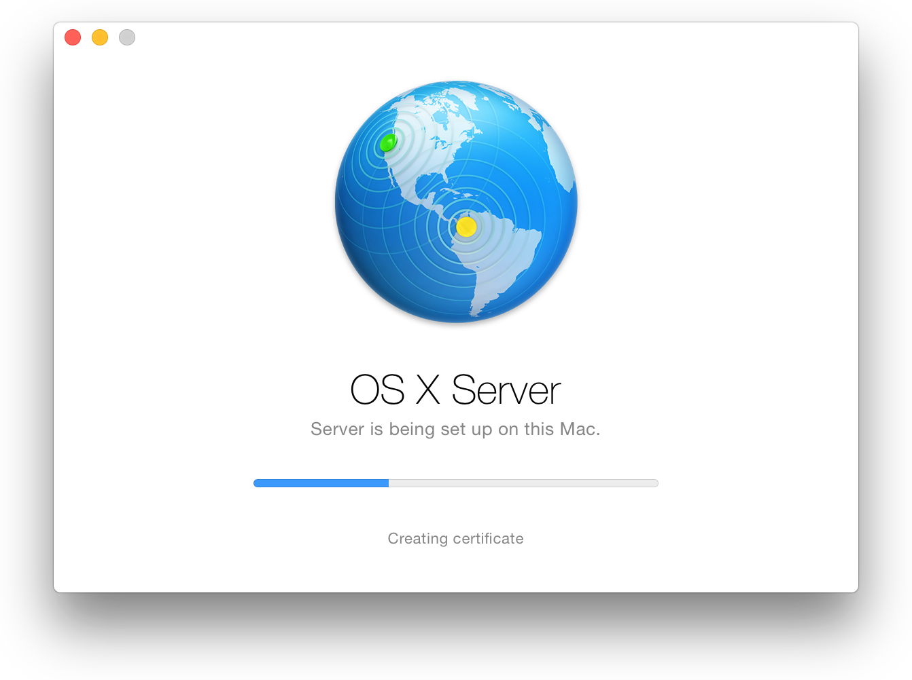

* 开始
  * [使用Xcode进行持续集成](quiver:///notes/B8F910ED-9426-4002-918D-079DEBDADFED)
* 设置Xcode Server
   * [安装OS X Server并配置Xcode Server](quiver:///notes/B155FC18-728C-43C3-8B18-90A5BCC53A3C)
   * [启用对源代码仓库的访问](quiver:///notes/E631BFE3-D44B-415A-AD71-2000EE434F76)
   * [配置bot以执行持续集成](quiver:///notes/65119961-EEA9-48ED-BDC5-6084BABDAF24)
   * [Xcode Server环境变量参考](quiver:///notes/D1A19475-8618-4E27-B801-143C7B0DDB01)
* 管理和监测Bot
   * [从报告导航器管理和监测Bot](quiver:///notes/3BC9417A-D0CC-4BF6-A8C5-DBF427699713)
   * [从Web浏览器监控Bot](quiver:///notes/C97641EE-3B4E-4BE9-A2CF-39B4FB276DA7)

# 安装OS X Server并配置Xcode Server
使用Xcode Server之前，您需要在一台Mac上安装并配置OS X Server和Xcode。您可以在开发Mac上编写代码并允许Server在特定计划中、提交代码到源代码仓库时执行您软件产品的集成或者手动集成。

Xcode Server在本地网络中通过Bonjour进行通信。如果您和其他团队成员只通过本地网络访问Xcode Server,您可以使用Bonjour来查找Xcode Server。如果您需要更大范围的访问Xcode Server服务，您需要让您的DNS服务器管理员将运行OS X Server的Mac加入到DNS服务器中。添加这些信息后，用户可以通过host名（比如server.mycompany.com）访问服务器。如果您的网络没有DNS服务器，您和其他成员可以通过本地hostname（比如server.local）访问服务器。

> **备注**

> 一个持续集成工作流通常依赖一个或多个运行Xcode的开发Mac和一个单独的运行启用Xcode Server的OS X Server。这样的配置有利于评估如何进行持续集成。总的来说，您会发现有一台专有的服务器对于运行Xcode Server、托管仓库和远端执行持续集成更有利。

## 下载 OS X Server和Xcode
在配置Xcode Server之前，您需要一台Mac下载并安装OS X Server和Xcode。为了保证组件间的兼容性，最好同时安装所有的系统更新。

**安装OS X Server**

1. 在作为服务器的Mac上打开App Store, 搜索OS X Server。
2. 从App Store下载OS X Server。
3. 下载完成后，在应用程序文件夹或者Launchpad中启动OS X Server应用，简称为`Server`。
4. 当弹出提示时，在Server设置窗口点击`Continue`开始设置服务器（或者点击`Help`查看详细的设置说明）。
  
5. 按照屏幕上的说明完成安装。
  当您在Mac上输入管理员账户和密码后，Server应用将会安装所需软件并配置您的Mac作为服务器运行。
  

> **重要**

> 您同时必须在服务器上安装Xcode。即使您并不打算在服务器上通过Xcode直接开发软件，Xcode Server仍然需要Xcode才能运行。

**安装Xcode**

1. 在作为服务器的Mac上打开App Store, 搜索Xcode。
2. 从App Store下载Xcode。
3. 下载完成后，在应用程序文件夹或者Launchpad中启动Xcode。
4. 当弹出提示时，输入您的管理员账户凭据以配置Xcode。

> **备注**

> 您的必须运行Xcode 6或者更高版本。如果您有较老的Xcode版本，启动App Store，点击工具栏上的`更新`按钮更新Xcode。

## 设置Xcode Server
当OS X Server和Xcode安装好后，您可以准备配置并启动Xcode Server。这个在Server应用中完成。

> **备注**

> Xcode服务器需要有一个能在服务器登录的账户才能执行集成。建议这是一个专用的非管理账户。如果您还没有针对Xcode Server的账户，一种方式您可以在安装过程中创建。

**配置Xcode Server**

1. 启动Server程序（如果没有运行的话）。您可以点击Dock栏的Launchpad图标，然后点击Server应用。
2. 在Server程序侧边栏的服务列表上选择Xcode。
  
3. 点击`Choose Xcode`，选择Xcode。
  
  第一次在特定的Mac上开启Xcode Server时，服务器会要求您确定用来执行任务的Xcode版本。如果您需要在之后确定不同的Xcode版本，请再次点击`Choose Xcode`。
  
4. 选择一个Xcode Server可以用来执行集成的账户。这可以是当前的账户或者可以创建一个新账户。
  
  
  要创建新账户，选择`New user account`并输入全名，账户名和密码。如果需要，可以开启管理员权限。这在执行特定自动化测试时可能是必要的。完成后，点击`Create User`。
  
5. 如果所选账户没有登录，请点击`Log In`并且输入账户凭据。Xcode Server要求一个登录账户才能操作。
  

  > **备注**
  
  > Xcode Server用户账户并不需要是活动账户。当登入服务器账户后，如果需要可以登录回到另一个账户。  

**开启或关闭Xcode Server**

1. 在Server程序侧边栏的服务列表上选择Xcode。
2. 点击窗口右上角的打开/关闭开关。
  
  
   当Xcode Server在运行和执行操作时Xcode Server菜单栏按钮会显示。
    

将您的服务器添加到开发帐号中的某个团队，以允许Xcode Server访问您的开发者账户信息，比如provisioning profiles和signing certificates用来构建iOS设备的产品。如果您计划使用Xcode Server来测试iOS产品并在iOS设备上执行性能测试时这是必要的。注意，如果您要将服务器加到团队中您必须是一个管理员或者团队代理人。关于团队角色的信息，参见在[App Distribution Guide](https://developer.apple.com/library/content/documentation/IDEs/Conceptual/AppDistributionGuide/Introduction/Introduction.html#//apple_ref/doc/uid/TP40012582)中的[Managing Your Developer Account Team](https://developer.apple.com/library/content/documentation/IDEs/Conceptual/AppDistributionGuide/ManagingYourTeam/ManagingYourTeam.html#//apple_ref/doc/uid/TP40012582-CH16)。

**添加一个服务器到团队**

1. 在Server程序侧边栏的服务列表上选择Xcode。
2. 在Xcode面板上，单击`Settings`栏。
  
3. 在设置面板，单击`Add Team`。
  
4. 登录您的Apple ID
  
5. 选择一个团队（如果适用），然后单击`Add`。

  Server程序会连接到您的开发者账户并且下载您团队注册的应用的证书，私钥，signing identities,和provisioning profiles。
  
当添加团队到Xcode Server后，您可以添加iOS开发设备，以便在运行性能测试的时候使用。

**更改成员创建/查看bot权限**

1. 在Server程序侧边栏的服务列表上选择Xcode。
2. 在Xcode面板上，单击`Settings`栏。
  
3. 在`Settings`窗口`Access`下，单击`Edit`按钮获取权限。
4. 选择可以创建和查看bot的成员。
  
  如果您在`Bots can be created and viewed by`的弹出菜单栏中选择`all users`，游客和每一个经过身份验证的用户都可以查看、创建、编辑和删除bot以及下载项目。`loged in users`包括所有需要经过身份验证才能访问bot的本地用户和目录用户。单击`only some users`允许您指定现有用户或组。
5. 如果您选择限制bot的创建，您也可以选择限制只可查看bot的访问。只有查看权限的用户可以访问Xcode Server网站（参阅从_Web浏览器监控Bot_:[官方文档](https://developer.apple.com/library/content/documentation/IDEs/Conceptual/xcode_guide-continuous_integration/MonitorBotsandDownloadProductsfromaWebBrowser.html#//apple_ref/doc/uid/TP40013292-CH10-SW1),[中文文档](quiver:///notes/C97641EE-3B4E-4BE9-A2CF-39B4FB276DA7)）并且启动集成，但他们无法创建和管理bot。特别受益于具有只访问bot活动权限的人员是软件测试人员，项目经理和种子协调员。
6. 单击`OK`。

## 设置您的开发Mac访问Xcode Server
您可以添加一个服务器账户到您的开发Mac。一旦添加后，您可以创建bot来运行集成，启动集成和检查bot在Xcode报告栏中的状态。您也可以创建一个新项目并托管到服务器上的git仓库。

**添加一个OS X Server账户到一台开发Mac上的Xcode**

1. 在您的开发Mac上，选择Xcode->Preferences。
2. 单击工具栏中的`Accounts`
3. 单击添加按钮（+），选择Add Server。
4. 从服务器列表选择服务器或者输入一个服务器地址，然后单击`Next`按钮。
5. 指定服务器连接凭据，然后单击`Add`。
  
  
  如果服务器成功配置，您可以单击Xcode中Account首选项的服务器地址链接。Safari将会打开并展现服务器托管的bot网站，正如_Web浏览器监控Bot_:[官方文档](https://developer.apple.com/library/content/documentation/IDEs/Conceptual/xcode_guide-continuous_integration/MonitorBotsandDownloadProductsfromaWebBrowser.html#//apple_ref/doc/uid/TP40013292-CH10-SW1),[中文文档](quiver:///notes/C97641EE-3B4E-4BE9-A2CF-39B4FB276DA7)所探讨的。

> **备注**

> 选中服务器的软件配置（OS X、OS X Server和Xcode的版本）会显示在Xcode的Accounts首选项的底部。当试图在多服务器中标识特定服务器时这些信息会很有用。