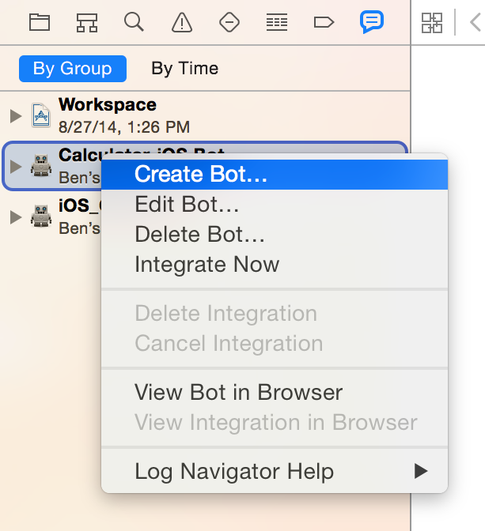
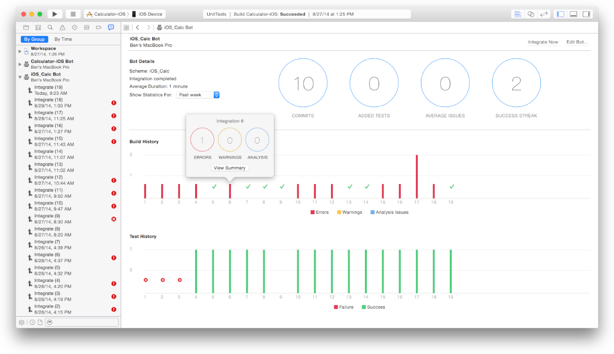
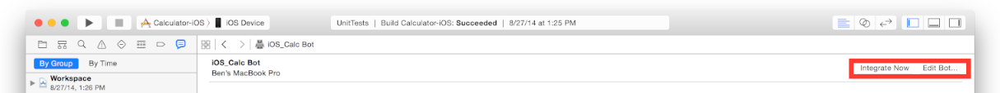
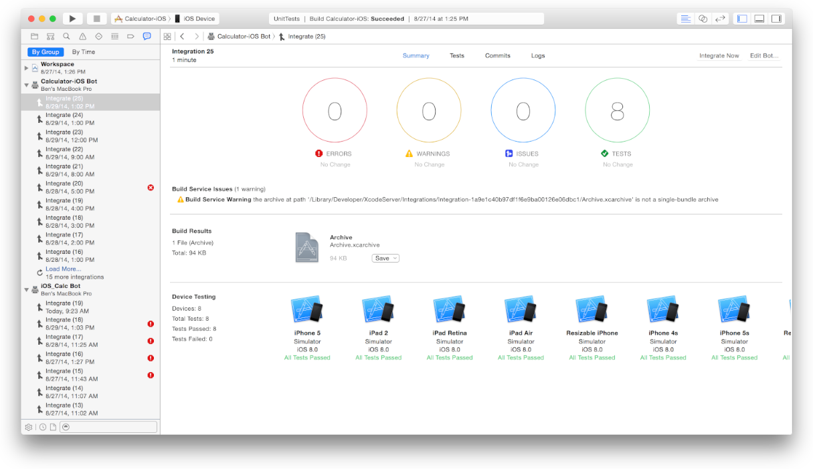
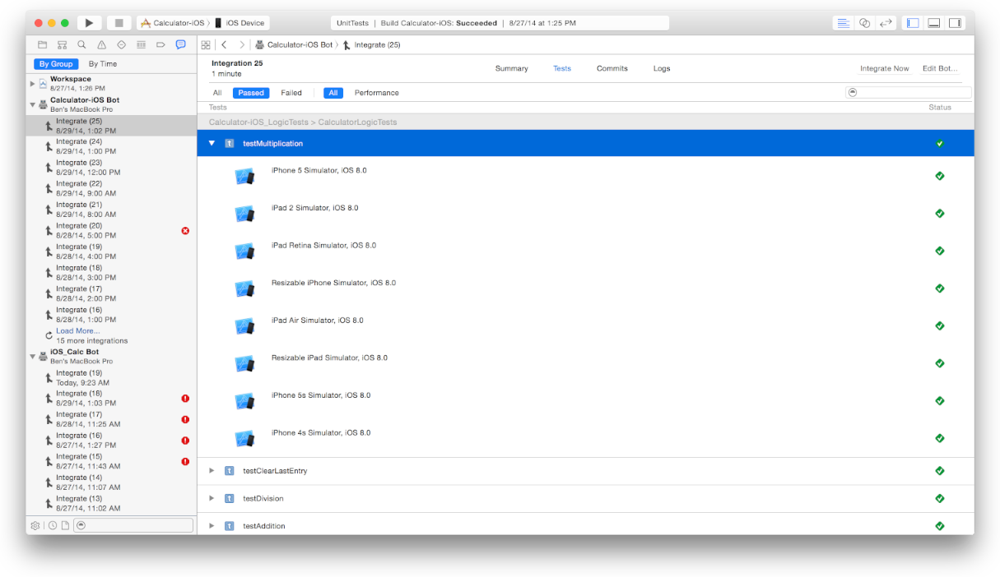
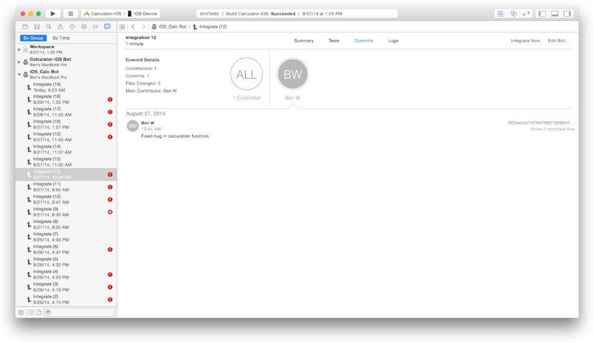
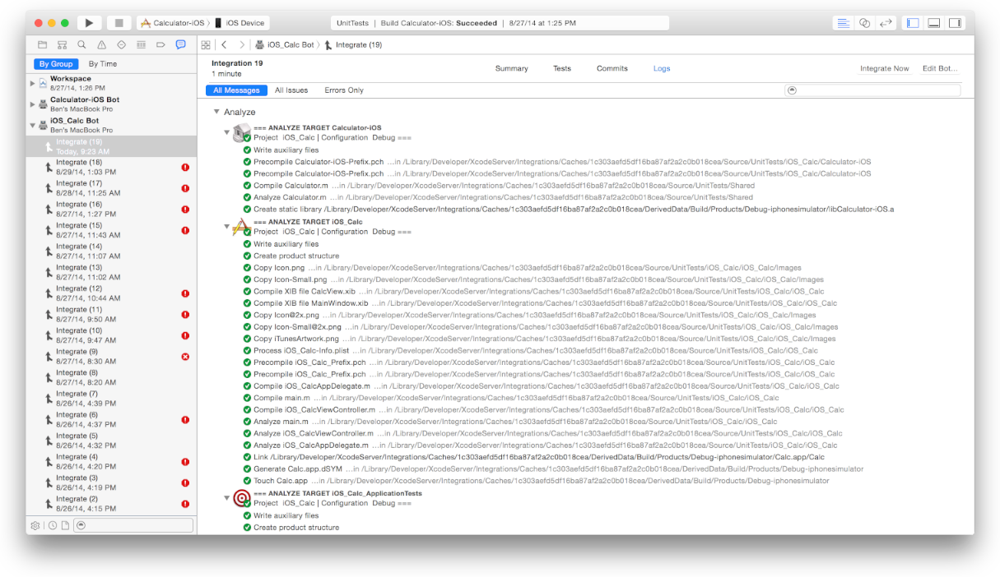
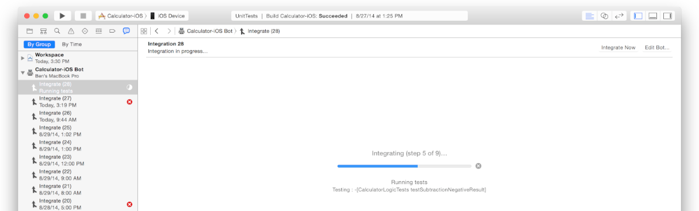

* 开始
  * [关于Xcode中的持续集成](《Xcode Server and Continuous Integration Guide - About Continuous Integration in Xcode》官方文档中文翻译（一）.md)
* 设置Xcode Server
   * [安装OS X Server并配置Xcode Server](《Xcode Server and Continuous Integration Guide - Install OS X Server and Configure Xcode Server》官方文档中文翻译（二）.md)
   * [启用对源代码仓库的访问](《Xcode Server and Continuous Integration Guide - Enable Access to Your Source Code Repositories》官方文档中文翻译（三）.md)
   * [配置bot以执行持续集成](《Xcode Server and Continuous Integration Guide - Configure Bots to Perform Continuous Integrations》官方文档中文翻译（四）.md)
   * [Xcode Server环境变量参考](《Xcode Server and Continuous Integration Guide - Xcode Server Environment Variable Reference》官方文档中文翻译（五）.md)
* 管理和监测Bot
   * [从报告导航器管理和监测Bot](《Xcode Server and Continuous Integration Guide - Manage and Monitor Bots from the Report Navigator》官方文档中文翻译（六）.md)
   * [从Web浏览器监控Bot](《Xcode Server and Continuous Integration Guide - Monitor Bots from a Web Browser》官方文档中文翻译（七）.md)

# 从报告导航器管理和监测Bot
在您的开发Mac上，Xcode报告导航器提供了对bot及其在服务器上执行的集成的详细信息的访问。当在报告导航器中选择一个bot或者集成，您可以在Xcode工作台编辑器区域中查看其信息。您也可以从报告导航器中编辑、删除和创建bot，并开启或取消集成。

## 在报告导航器中管理bot
在您开发Mac上的Xcode中，您可以选择`View > Navigators > Show Report Navigator`或者在导航栏（图6-1）上点击报告导航器按钮来显示您的bot列表。您可以点击`By Group`来显示每个bot下收集的状态信息。
  
  
您可以按住`Control`并点击bot来显示快捷菜单（如图6-2），允许您：

  - 创建新的bot。
  - 编辑bot——您可以更改其scheme、名称、计划、操作、邮件收件人和测试设备。
  - 删除bot——当您移除bot，将会停止之后的集成操作并移除已有的构建和归档文件。
  - 立即开启一次bot集成——在您的bot编译好源文件之前，Xcode会显示bot集成的实时进度信息。
  - 取消当前正在执行的集成。
  

## 在Bot查看器中监测和管理Bot
您可以在Xcode报告导航器中选中bot，查看集成的摘要信息。

**查看bot的集成摘要结果**

  1. 在报告导航器顶部，单击`By Group`。
    每个bot的状态信息会集中显示。
  2. 选择您想查看的bot的集成。
    在工作台窗口的编辑器区域，bot查看器会显示bot执行的集成的摘要信息，以及任何提交、构建错误和警告，静态分析问题和测试失败信息。
    
您可以在工作台窗口的编辑器区域启动一些bot管理操作。
  
  
  - 要开始一次集成，单击`Integrate Now`。
  - 要更新bot，单击`Edit Bot`。
在编辑器区域，bot查看器的摘要栏显示一下元素：
  - **Bot详情**。scheme、当前集成状态、平均耗时、提交次数、测试数、平均问题数和成功次数。您可以配置`Bot Details`部分显示今天、这周或这个月的统计信息。
  - **构建历史**。条形图描述了bot构建时遇到的错误、警告和静态分析问题。单击一个条形图来显示问题的记录。
  - **测试历史**。bot执行的成功数和失败的测试用例数。单击一个条形图来显示通过和失败的记录。

## 在集成查看器中回顾集成详情
您可以通过在报告导航器中选中集成来查看集成的详细信息。

**查看集成的详细信息**

  1. 在报告导航器顶部，单击`By Group`。
    集成列表（如果尚未显示）会折叠在每个bot栏目下。
  2. 选择您想查看的bot的集成。
  3. 如果bot的集成尚未显示，请点击bot左侧的显示三角形以对应的集成。
    在报告导航器上列出的每个集成的右侧，Xcode显示一个图标来指示是否有错误、警告、静态分析问题或集成故障。一目了然的允许您快速评估bot的集成状态。
  4. 选择一个特定的集成。
    
    
    在工作台窗口的编辑器面板，集成查看器显示的信息，包含：
    
    - 集成结果的摘要。
    - 错误、警告、静态分析问题数量和测试用例失败的数量。
    - 如果有，会列出新的问题、解决的问题和构建服务问题。
    - 如果有，构建结果区域允许您下载产品的归档文件。
    - 列出所有设备测试成功或失败状态的摘要。
  5. 在工作台窗口的编辑器面板，单击`Tests`来查看测试列表和集成测试的成功或失败状态。
  
    如果您有多种测试设备，单击某个测试左侧的显示三角形来查看各个设备的成功或失败状态。
    
    
    如果您的项目被配置执行性能测试，您可以查看性能测试结果并指定基准线。为性能测试指定基准会为测试增加价值，如果测试低于基准线以下的某个阈值，则会导致集成失败。
  6. 在工作台窗口的编辑器面板，单击`Commits`来查看集成中包含的新的提交信息。您可以查看所有提交者的提交信息，或者可以选择单个提交者。
  
    通过点击"Show modified files"按钮，您可以在Xcode的比较视图中查看提交文件的更改部分，从而允许您区分所做的特定更改的代码。
    
  7. 在工作台窗口的编辑器面板，单击`Logs`来查看集成期间执行的操作的日志。使用过滤器来显示所有的日志消息，问题或者错误，并使用搜索字段来查找特定消息。
    
    
如果bot正在执行选中的集成，编辑器会显示实时进度而不是集成结果，如图6-3。结果会在集成结束后显示。
